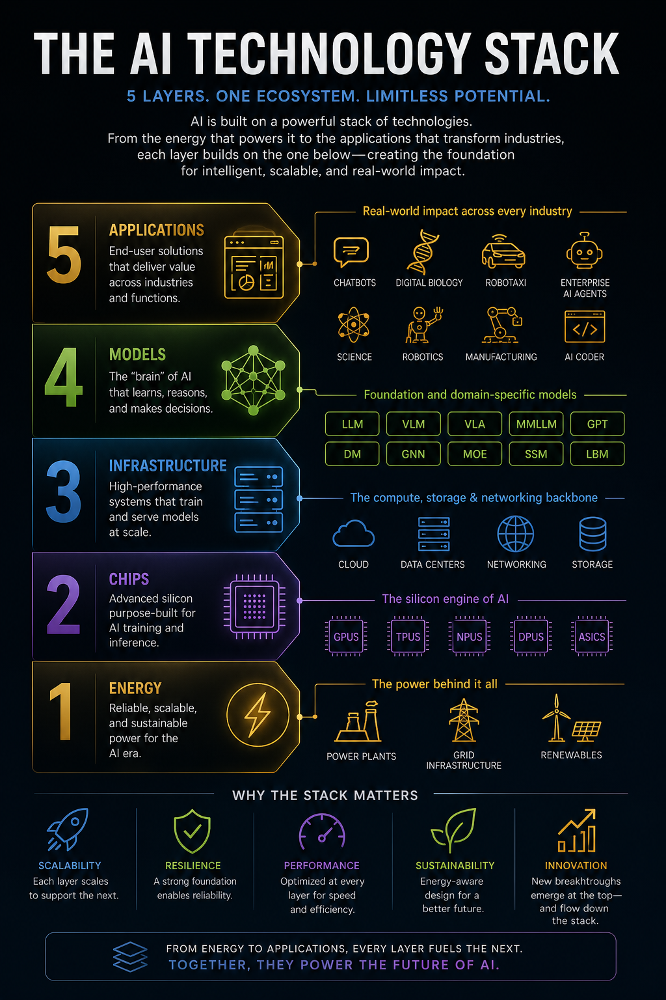

# Quickstart: The 5-Layer AI Stack

AI can feel like smoke and mirrors until you see the stack underneath it. This first learning burst is the map: **energy → chips → infrastructure → models → applications**.

The point is not to memorize a taxonomy. The point is to learn how to read AI news, product claims, and market moves without getting hypnotized by the shiny demo at the top.

## What you will learn

By the end of this quickstart, you should be able to:

- Name the five layers of the AI stack.
- Explain what each layer contributes to the system.
- Trace how a breakthrough or bottleneck in one layer affects the others.
- Use the stack as a diagnostic tool when evaluating AI products, companies, and headlines.

## The stack at a glance

| Layer | Plain-English role | Core question |
| --- | --- | --- |
| **5. Applications** | The tools people actually use: chatbots, copilots, agents, robotics, science tools, AI coders, and industry workflows. | What job does this AI system do for a person or organization? |
| **4. Models** | The learned “brain” that predicts, reasons, generates, classifies, plans, or controls. | What capability is being packaged into intelligence? |
| **3. Infrastructure** | The data centers, cloud systems, storage, networking, orchestration, and serving machinery that run models at scale. | Can this system train and serve reliably, quickly, and affordably? |
| **2. Chips** | The specialized silicon — GPUs, TPUs, NPUs, DPUs, ASICs — that makes AI computation practical. | What hardware turns electricity into useful AI compute? |
| **1. Energy** | The power generation, grid, and cooling reality beneath the entire system. | Is there enough reliable power to run the stack? |

This is adapted from NVIDIA’s “5-layer cake” framing, but we’ll use **stack** because we are not decorating a birthday dessert here. We are learning the machine.

Source: [NVIDIA — The AI 5-Layer Cake](https://blogs.nvidia.com/blog/ai-5-layer-cake/)

## Layer 1: Energy — the power behind it all

AI starts before the chip. It starts with electricity.

Training frontier models and serving millions of daily requests requires reliable, scalable power. Data centers need energy for compute, cooling, redundancy, and networking. If power is scarce, expensive, dirty, or unreliable, every layer above it gets squeezed.

**Watch for:** power plants, grid capacity, renewables, energy contracts, cooling constraints, data-center locations, and sustainability claims.

**Quick read:** when a company announces a giant AI data center, ask: *where does the power come from, and can the grid actually support it?*

## Layer 2: Chips — the silicon engine

Chips are where energy becomes computation.

AI workloads are unusually hungry for parallel math and fast memory movement. That is why GPUs became the default AI workhorse, and why TPUs, NPUs, DPUs, ASICs, high-bandwidth memory, and interconnects matter. Better chips can make models faster, cheaper, and more capable — but only if the rest of the system can feed them data and power.

**Watch for:** GPUs, accelerators, memory bandwidth, interconnects, packaging, supply constraints, inference chips, and cost per token.

**Quick read:** when a model gets cheaper or faster, ask: *was the gain from a better model, better chips, better serving infrastructure, or all three?*

## Layer 3: Infrastructure — the backbone

Infrastructure is the operating environment for AI at scale.

It includes cloud platforms, data centers, storage, networking, training clusters, inference fleets, schedulers, monitoring, reliability systems, and deployment pipelines. A model can look magical in a lab and still fail in production if the infrastructure cannot serve it with low latency, high uptime, and sane cost.

**Watch for:** cloud regions, data centers, networking, storage, Kubernetes, model serving, observability, latency, uptime, and utilization.

**Quick read:** when an AI app feels slow or expensive, ask: *is the bottleneck the model, the chips, the serving stack, or demand overwhelming capacity?*

## Layer 4: Models — the capability layer

Models are the learned systems that create AI behavior.

Large language models, vision-language models, diffusion models, graph neural networks, mixture-of-experts systems, state-space models, and domain-specific models all belong here. Models encode capability, but they are not the whole product. They still depend on the layers below and only create value when connected to useful applications above.

**Watch for:** LLMs, VLMs, multimodal models, context windows, embeddings, training data, fine-tuning, inference, evaluation, and hallucination risk.

**Quick read:** when someone says “we have a better model,” ask: *better at what task, measured how, and does that improvement matter in the real workflow?*

## Layer 5: Applications — where value shows up

Applications are where AI becomes useful.

This layer includes chatbots, enterprise agents, AI coding tools, digital biology, robotics, manufacturing systems, robotaxis, scientific discovery platforms, and industry-specific copilots. Applications package models into workflows, interfaces, permissions, integrations, and outcomes.

**Watch for:** user experience, workflow integration, data access, trust, evaluation, compliance, cost, and whether the tool changes a real decision or process.

**Quick read:** when an AI product looks impressive, ask: *what layer is doing the hard work, and what layer could break first?*

## How the layers pull on each other

The stack is not five isolated boxes. It is one ecosystem:

- **Applications pull demand downward.** A popular AI coding tool or agent product increases inference demand, which stresses infrastructure, chips, and energy.
- **Models reshape infrastructure.** A new model architecture can change memory needs, latency, serving costs, and hardware preferences.
- **Chips unlock model behavior.** More efficient hardware makes larger context windows, faster inference, and cheaper experimentation possible.
- **Infrastructure decides whether demos survive reality.** Scaling from a benchmark to millions of users is an infrastructure problem as much as a model problem.
- **Energy sets the ceiling.** The stack can only expand where power, cooling, and grid capacity can keep up.

## Try it: read one headline through the stack

Pick an AI headline and walk it down the layers.

Example: “A company launches an enterprise AI agent.”

Ask:

1. **Application:** What job does the agent do?
2. **Model:** What model capability does it rely on?
3. **Infrastructure:** What has to run reliably for users all day?
4. **Chips:** What hardware makes the cost and latency workable?
5. **Energy:** What physical resources scale when usage grows?

If you can answer those five questions, you are no longer just reading AI hype. You are reading the system underneath it.

## Check yourself

- Which layer is closest to the user?
- Which layer is easiest to forget because it is physically far from the software interface?
- Why can a model improvement reduce pressure on chips and infrastructure?
- Why can an application fail even if the model is strong?
- When AI demand grows, which layers feel the pressure first?

## What comes next

This quickstart is the lay of the land. The next learning bursts will go deeper into each layer:

1. **Energy:** why AI starts with power.
2. **Chips:** why GPUs and accelerators matter.
3. **Infrastructure:** how models run at scale.
4. **Models:** what the “brain” actually is.
5. **Applications:** how AI creates economic value.

Keep the stack in your head. Every serious AI story touches more than one layer.
